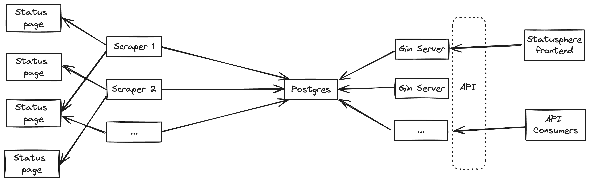

<div align="center">

</div>
<br/>

<div align="center">


</div>

An open-source api-first status page aggregator.

If you're looking for the official hosted version, head [here](https://metoro.io/statusphere).

Read more about the project at the [launch blog post](https://metoro.io/blog/statusphere).

## Features

- Polls status pages of over 1000 popular services
- API first
- Webhook notifications of incidents

## API

Statusphere is API first, it has a frontend that consumes the API, but the API is the main focus of the project.
The api endpoints are here:

```bash

GET /api/v1/statusPage?statusPageUrl=XXX||statusPageName=XXX
GET /api/v1/currentStatus?statusPageUrl=XXX
GET /api/v1/statusPages
GET /api/v1/statusPages/count
GET /api/v1/statusPages/search?query=XXX
GET /api/v1/incidents?statusPageUrl=XXX

```

## Usage

Warning: This will spin up a local instance of the statusphere stack which will automatically scrape the status pages of
the services listed in the `status_pages.go` file.

If you want to quickly try the api you can hit the hosted version
```bash
curl 'https://statusphere.metoro.io/api/v1/incidents?statusPageUrl=https://www.githubstatus.com' | jq
```

To run the stack locally:

```bash
# From the root of the repository
docker-compose up

# The api server will be available at http://localhost:8080
curl http://localhost:8080/api/v1/statusPages/count
```

## Architecture

Statusphere is made up of 3 main components:

1. The scrapers
2. The database
3. The api servers

They're orchestrated in the following way:

<div align="center">

</div>


## Scraping mechanism

Each scraper periodically polls the database to get a list of status pages to scrape. 
After the time interval has passed, the scraper will scrape the status page and update the database with the new status.

### Parsing status pages

When a scraper scrapes a status page, it attempts to parse the page using `providers` in a cascading manner.
Each provider is responsible for parsing a specific type of status page. For example, the status.io provider is responsible for parsing status pages that are built using the status.io platform.
If a provider is unable to parse the status page it will return an error, and the next provider in the list will be attempted.

## Webhooks

Statusphere supports webhooks for incident notifications. You can set the slack webhook url in the environment variable `STATUSPHERE_SLACK_WEBHOOK_URL` in the job_poller container.

When an incident is created for the status page you subscribed to, a POST request will be sent to the webhook url with the incident payload.

## Contributing

We're actively welcoming contributions to Statusphere! Please read the [CONTRIBUTING.md](CONTRIBUTING.md) file for more information on how to get started.

If you want to add a status page, it's as simple as adding an entry [here](https://github.com/metoro-io/statusphere/blob/main/common/status_pages/status_pages.go)
